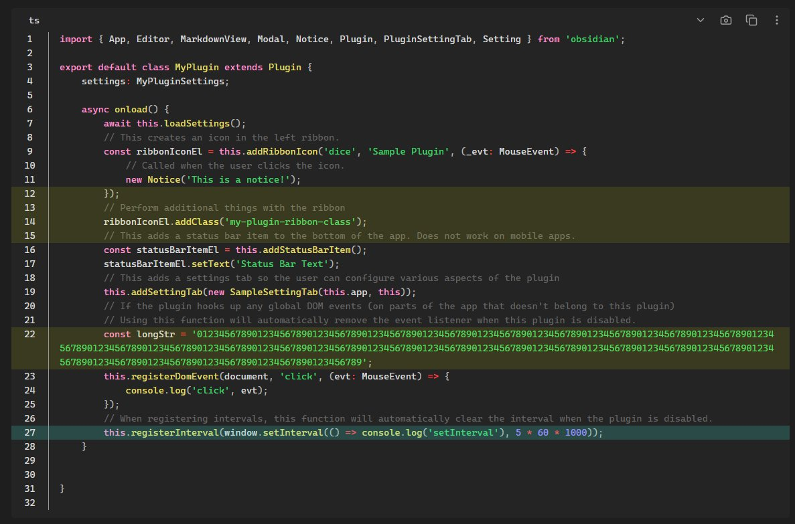
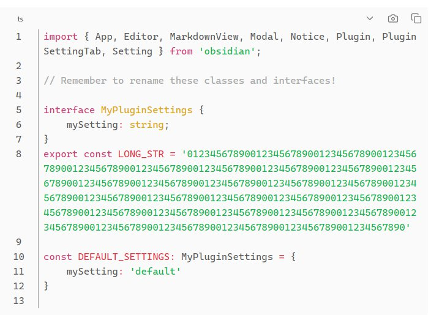
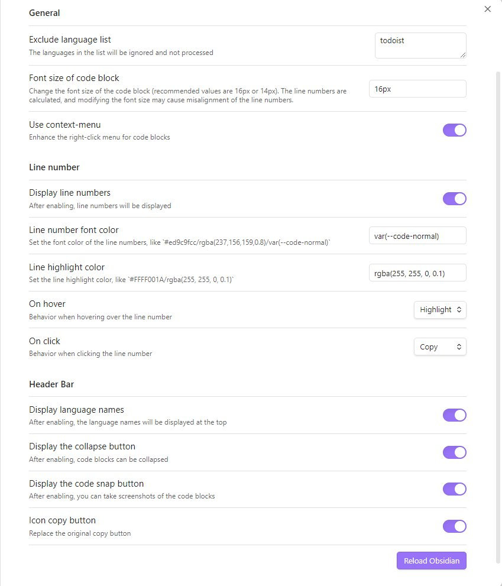

# Obsidian Code Block Enhancer

This is a plugin for Obsidian (https://obsidian.md).  
Inspired by [obsidian-code-block-copy](https://github.com/jdbrice/obsidian-code-block-copy).

**Note:** The Obsidian API is still in early alpha and is subject to change at any time!

## Feature

Enhancer the markdown code block in preview mode.

-   Provide line number
-   Show language name
-   Code snap
-   Custom exclusion language
-   Enhance contextmenu in code block
-   ......

## Screenshot

### Preview Mode

### Default Dark theme

### Default Light theme

### Plugin setting

# How to use

## Install

### BRAT

-   [Install the BRAT Plugin](https://obsidian.md/plugins?id=obsidian42-brat)
-   Execute command `Obsidian42 - BRAT: Add a beta plugin for testing`
-   Paste the URL of this repository and confirm
-   Enable plugin in Obsidian setting.

### Source Code

-   Clone this repo.
-   `npm i` or `yarn` to install dependencies
-   `npm run build` to build file in `./dist`.
-   Copy over `main.js`, `styles.css`, `manifest.json` to your vault `VaultFolder/.obsidian/plugins/obsidian-code-block-enhancer/`.
-   Enable plugin in Obsidian setting.

### Releases

-   Download `main.js`, `styles.css`, `manifest.json` in the [latest release](https://github.com/nyable/obsidian-code-block-enhancer/releases/latest)
-   Copy over `main.js`, `styles.css`, `manifest.json` to your vault `VaultFolder/.obsidian/plugins/obsidian-code-block-enhancer/`.
-   Enable plugin in Obsidian setting.
