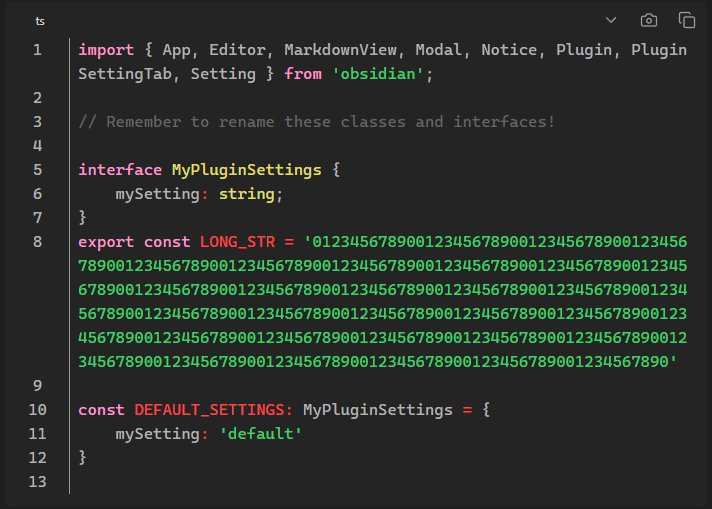
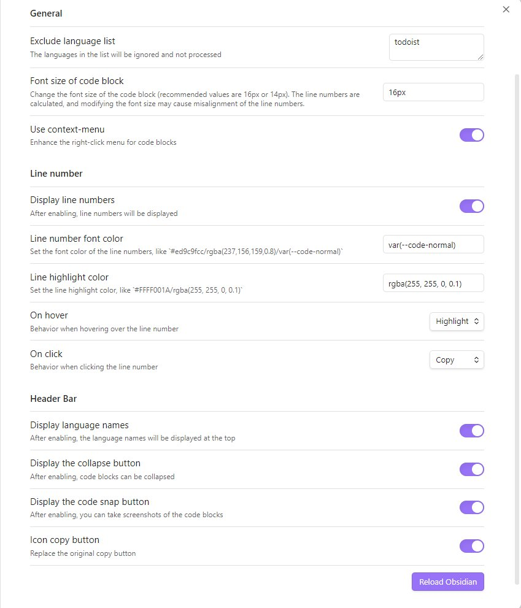

# Obsidian Code Block Enhancer

这是一个 [Obsidian](https://obsidian.md) 插件。
灵感来自于 [obsidian-code-block-copy](https://github.com/jdbrice/obsidian-code-block-copy)。

**注意：** Obsidian API 仍处于早期 alpha 阶段，随时可能发生变化！

## 功能

增强阅读模式下的 Markdown 代码块。

-   行号显示（支持换行）
-   行高亮
-   显示语言名称
-   代码截图（导出为图片）
-   增强的右键菜单
-   ......

## 截图

### 预览模式

### 默认深色主题

### 默认浅色主题

### 插件设置

# 如何使用

## 安装

### 通过 BRAT 安装

-   [安装 BRAT 插件](https://obsidian.md/plugins?id=obsidian42-brat)
-   执行命令 `Obsidian42 - BRAT: Add a beta plugin for testing`
-   粘贴此仓库的 URL 并确认
-   在 Obsidian 设置中启用插件。

### 源码安装

-   克隆此仓库。
-   运行 `npm i` 或 `yarn` 安装依赖
-   运行 `npm run build` 构建文件到 `./dist` 目录。
-   将 `main.js`, `styles.css`, `manifest.json` 复制到你的仓库目录 `VaultFolder/.obsidian/plugins/obsidian-code-block-enhancer/`。
-   在 Obsidian 设置中启用插件。

### 手动安装 (Releases)

-   在 [最新发布](https://github.com/nyable/obsidian-code-block-enhancer/releases/latest) 页面下载 `main.js`, `styles.css`, `manifest.json`
-   将 `main.js`, `styles.css`, `manifest.json` 复制到你的仓库目录 `VaultFolder/.obsidian/plugins/obsidian-code-block-enhancer/`。
-   在 Obsidian 设置中启用插件。
